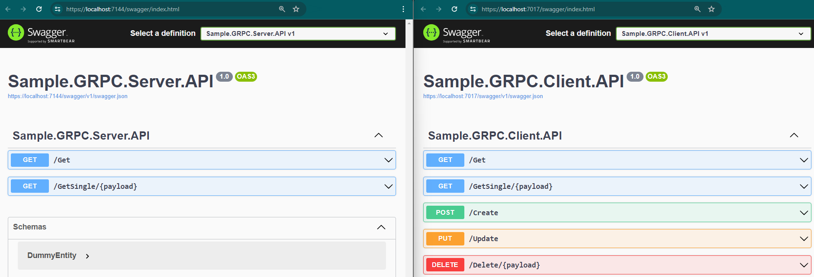

## Sample gRPC Implementation

This project presents a practical implementation of gRPC communication, featuring two distinct services:

1. **Sample.GRPC.Client.API**: This service encapsulates CRUD operations, leveraging a gRPC client to interact with the underlying Sample.GRPC.Server.API.
2. **Sample.GRPC.Server.API**: Operating as a gRPC server, this service facilitates CRUD operations. For testing purposes, an in-memory database has been utilized.



## Technical Explanation

### gRPC

gRPC stands as a contemporary, open-source RPC (Remote Procedure Call) framework, celebrated for its high performance and versatility. 

Advantages of gRPC:
- **High-Speed RPC Framework**: Offers advanced performance and agility in communication.
- **Contract-First Approach**: Leverages Protocol Buffers for API development, enabling language-agnostic implementations.
- **Streaming Support**: Facilitates seamless streaming communication for clients, servers, and bidirectional scenarios.
- **Efficient Serialization**: Minimizes network overhead through the binary serialization of Protobuf.

gRPC finds ideal application in:
- **Microservices Architectures**: Prioritizes efficiency and streamlined communication.
- **Polyglot Environments**: Enables development across multiple programming languages.
- **Real-Time Services**: Seamlessly handles streaming requests and responses.

Official Resources:

- Website: [gRPC.io](https://grpc.io/)
- .NET Documentation: [gRPC for .NET](https://grpc.io/docs/languages/csharp/)
- .NET Examples ([GitHub Repository](https://github.com/grpc/grpc-dotnet/tree/master/examples))

### Proto File

The initial step involves defining a proto file, within which we outline our gRPC service methods, requests, and response models.

Here's a segment of the proto file found within this project:

```protobuf
syntax = "proto3";

import "google/protobuf/any.proto";
import "google/protobuf/timestamp.proto";

option csharp_namespace = "SampleServiceProto";

package sampleservice;

service SampleServiceApi {
  rpc Gets (Empty) returns (responseEntitiesModel);
  rpc GetSingle (entityRequest) returns (responseEntityModel);
  rpc Create (CreationRequest) returns (operationCompleteModel);
  rpc Update (UpdateRequest) returns (operationCompleteModel);
  rpc Delete (entityRequest) returns (responseModel);
}

message entityModel {
  string id = 1;
  string name = 2;
  string description = 3;
  google.protobuf.Timestamp referenceDate = 4;
  google.protobuf.Timestamp modifiedDate = 5;
}

// Message and service definitions follow...
```

Key points:
- `csharp_namespace`: Specifies the namespace you can utilize within your C# code to reference the models defined in the proto file.
- `service SampleServiceApi`: Defines the service name and the methods it provides.
- `entityModel`: Provides a sample definition of an entity.

For further details about the syntax, refer [here](https://protobuf.dev/programming-guides/proto3/).

## Server API

The server-side implementation demonstrates efficient handling of CRUD operations.
After defining a proto file, it must be imported into our .NET project, with the type of **Server** specified.
Here's a sample excerpt from the project reference:

```
	<Protobuf Include="Protos\sampleservice.proto" GrpcServices="Server" />
```

Following the import of the proto file, a class is defined that inherits from `SampleServiceApi`.
Inside this class, the methods defined for the service in the proto file are overridden to provide custom implementation.

```csharp
public class GrpcSampleService : SampleServiceApi.SampleServiceApiBase
{
  public override async Task<responseEntitiesModel> Gets(Empty request, ServerCallContext context)
  {
      try
      {
          var lst = await dbContext.SampleEntities.ToListAsync();

          var response = new responseEntitiesModel() { Success = true };
          response.Items.AddRange(lst.Adapt<IEnumerable<entityModel>>());

          return response;
      }
      catch (Exception ex)
      {
          logger.LogError(ex, "An error occurred at {Gets}", nameof(Gets));

          var errorRetModel = new responseEntitiesModel() { Success = false };
          errorRetModel.Exceptions.Add(new apiException() { Message = ex.Message, StatusCode = 500 });
          return errorRetModel;
      }
  }


    // Other Method implementations...
}
```

## Client API

The client-side implementation provides a seamless interface for interacting with the server.

After defining a proto file, it must be imported into our .NET project, with the type of **Client** specified.
Here's a sample excerpt from the project reference:

```
	<Protobuf Include="GRPCClient\sampleservice.proto" GrpcServices="Client" />
```

Subsequently, we can register a GRPC client on our Dependency Injection:

```csharp
 services.AddGrpcClient<SampleServiceApi.SampleServiceApiClient>((services, options) =>
 {
     options.Address = new Uri(endpoint);
 });
```

Within the client project, a Service called `ServiceClientGrpc` is defined to wrap the actual GRPC client. This allows for encapsulation of all dependencies to gRPC within this service.

```csharp

private readonly SampleServiceApi.SampleServiceApiClient _client;

// Other code omitted for brevity

public class ServiceClientGrpc : IServiceClientGrpc
{
      public async Task<IEnumerable<SampleEntityGet>> Get()
      {
          var response = await _client.GetsAsync(new Empty(), _metadata);

          if (response.Success)
          {
              return response.Items.Adapt<IEnumerable<SampleEntityGet>>();
          }

          throw new InvalidOperationException(string.Join(',', response.Exceptions.Select(x => x.Message)));
      }

      // Other code omitted for brevity
}
```

## Other Considerations

Within this project, [Mapster](https://github.com/MapsterMapper/Mapster) is employed to automate the mapping of gRPC models to C# classes.

For some classes, custom mappers are defined, as illustrated below:

```csharp
  TypeAdapterConfig<entityModel, SampleEntityGet>.NewConfig()
  .Map(dest => dest.Id, src => Guid.Parse(src.Id))
  .Map(dest => dest.Name, src => src.Name)
  .Map(dest => dest.Description, src => src.Description)
  .Map(dest => dest.ReferenceDate, src => src.ReferenceDate.ToDateTime())
  .Map(dest => dest.LastTimeModified, src => src.ModifiedDate.ToDateTime()); 


  TypeAdapterConfig<SampleEntityPost, CreationRequest>.NewConfig()
  .Map(dest => dest.Item.Name, src => src.Name)
  .Map(dest => dest.Item.Description, src => src.Description)
  .Map(dest => dest.Item.ReferenceDate, src => Google.Protobuf.WellKnownTypes.Timestamp.FromDateTime(src.ReferenceDate));
```

At this point, the **.Adapt** method can be used to convert gRPC models to API models.

```csharp
response.Items.Adapt<IEnumerable<SampleEntityGet>>();
```

## Microsoft Official Documentation

For further exploration and detailed guidance, refer to Microsoft's official documentation:

- [gRPC with ASP.NET Core](https://learn.microsoft.com/en-us/aspnet/core/tutorials/grpc/grpc-start?view=aspnetcore-8.0&tabs=visual-studio)
- [ASP.NET Core gRPC Documentation](https://learn.microsoft.com/en-us/aspnet/core/grpc/?view=aspnetcore-8.0)
